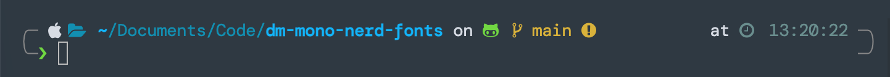

# Summary

Apply the [Nerd Fonts Patcher](https://github.com/ryanoasis/nerd-fonts) on the [DM Mono](https://github.com/googlefonts/dm-mono) font to obtain a [powerlevel10k](https://github.com/romkatv/powerlevel10k) compliant font.



# Usage
* Download patched fonts from subdirectory `dm-mono-nerd-font`.
* Patch manually from sources (see [nerd font's document](https://github.com/ryanoasis/nerd-fonts#font-patcher) for more details):

```bash
git submodule update --init --recursive

for file in dm-mono/exports/DMMono*.ttf; do
    fontforge -script ./nerd-fonts/font-patcher -c $file -out dm-mono-nerd-font
done
```

# Related Project
* dm-mono: https://github.com/googlefonts/dm-mono
* nerd-fonts: https://github.com/ryanoasis/nerd-fonts
* powerlevel10k: https://github.com/romkatv/powerlevel10k
